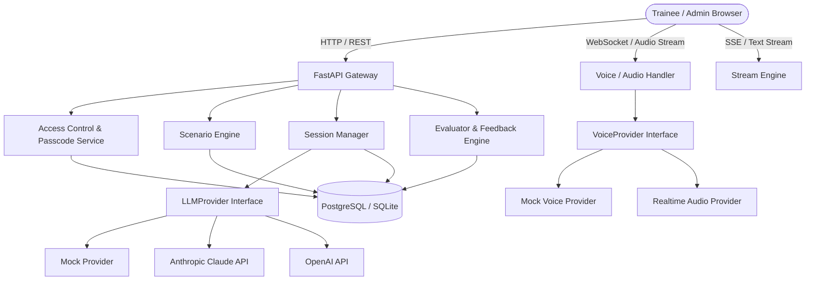

# System Architecture Document

## 1. System Overview
The application consists of a decoupled Single Page Application (React/TypeScript) interacting with a high-performance asynchronous FastAPI backend. Real-time dialogue is facilitated via Server-Sent Events (SSE) and WebSockets.

## 2. Key Subsystems
### 2.1 Access & Passcode Management
- **Cohort Lifecycles**: Hard 30-day enforcement checked at database and middleware layers.
- **Passcode Authentication**: Passcodes are generated via `secrets` (e.g. `K7QM-4PXD`), hashed with PBKDF2/Argon2/bcrypt. Plaintext is only presented upon generation/rotation.
- **Session Tokens**: JWT access tokens (12h expiration or remaining cohort duration).

### 2.2 Scenario Engine
- **Data Model**: YAML/JSON scenarios validated against strict Pydantic schemas.
- **Versioning**: Every update creates a snapshot in `scenario_versions`. Active sessions bind to the specific snapshot version.
- **Security Barrier**: Trainee-facing APIs strip `hidden_motivations`, `objections`, and internal curveball triggers.

### 2.3 Conversation Engine
- **State Machine**: Tracks turns, conversation timeline, fired curveballs, and emotional tone.
- **Curveball Manager**: Evaluates triggers dynamically and feeds hidden director guidance to LLM.
- **Conclusion Detector**: Evaluates conversational wrap-up signals (agreements, walkaways, natural endings).

### 2.4 Evaluator & Feedback Engine
- **Transcript Ingestion**: Consumes timestamped dialogue history, scenario success criteria, and skill rubrics.
- **Deterministic Math**: Computes overall score:
  $$\text{Score} = \text{round}\left(\sum w_i \times \frac{s_i - 1}{4} \times 100\right)$$
- **Grounding Verification**: Validates that all quoted moments exist verbatim in the transcript.

### 2.5 Voice Pipeline
- **Realtime Path**: WebSocket streaming PCM/Opus chunks with Voice Activity Detection (VAD) and client barge-in interruption (<300ms).
- **Fallback Path**: Streaming STT -> LLM streaming -> sentence-chunked TTS.
- **Unified Capture**: Voice turns are transcribed in real time to the same message store used for evaluation.
